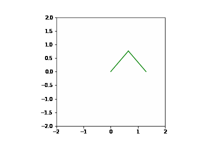
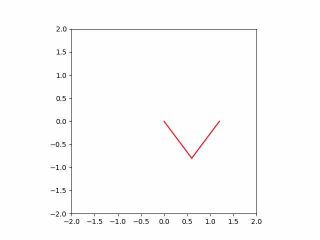

# Rob Boss - Painting Robot (Disciple of Bob Ross)
#### Contributors: Vincent Pierce, Conrad Kinsey, Hayden Jeanor

##Contents

[Overveiw](https://github.com/VincentPierc/Rob-Boss_Painting-Bot#overview)
[Mechanical Design](https://github.com/VincentPierc/Rob-Boss_Painting-Bot#mechanical-design)
[Design Process](https://github.com/VincentPierc/Rob-Boss_Painting-Bot#design-process)
[First Iteration](https://github.com/VincentPierc/Rob-Boss_Painting-Bot#first-iteration)
[Redesign](https://github.com/VincentPierc/Rob-Boss_Painting-Bot#redesign)
[Final Implementation](https://github.com/VincentPierc/Rob-Boss_Painting-Bot#final-implementation)
[Paintbrush Actuation](https://github.com/VincentPierc/Rob-Boss_Painting-Bot#paintbrush-actuation)
[Matching the 2D Kinematics](https://github.com/VincentPierc/Rob-Boss_Painting-Bot#matching-the-2d-kinematics)
[Main Housing](https://github.com/VincentPierc/Rob-Boss_Painting-Bot#main-housing)
[Key Takeaways](https://github.com/VincentPierc/Rob-Boss_Painting-Bot#key-takeaways)
[Gear Reduction](https://github.com/VincentPierc/Rob-Boss_Painting-Bot#gear-reduction)
[Don’t Reinvent the Wheel](https://github.com/VincentPierc/Rob-Boss_Painting-Bot#dont-reinvent-the-wheel}
[Add a Third Dimension](https://github.com/VincentPierc/Rob-Boss_Painting-Bot#add-a-third-dimension)
[Electrical Design](https://github.com/VincentPierc/Rob-Boss_Painting-Bot#electrical-design)
[Motor Controlling](https://github.com/VincentPierc/Rob-Boss_Painting-Bot#motor-controlling)
[Solenoid Actuating](https://github.com/VincentPierc/Rob-Boss_Painting-Bot#solenoid-actuating)
[Software Design](https://github.com/VincentPierc/Rob-Boss_Painting-Bot#software-architecture)
[Software Architecture](https://github.com/VincentPierc/Rob-Boss_Painting-Bot#software-architecture)
[Kinematics](https://github.com/VincentPierc/Rob-Boss_Painting-Bot#kinematics)
[Newton Raphson](https://github.com/VincentPierc/Rob-Boss_Painting-Bot#newton-raphson)

## Overview
Rob Boss (disciple of Bob Ross) is a 2 1/2 degree of freedom pen-plotting robot with a twist. This robot is capable of painting whatever HPGL file that is uploaded to its hard-drive. The project was created for our ME 405 Mechatronics term project at California Polytechnic State University San Luis Obispo.

With a STM32 Arm Cortex MCU on a Nucleo-64 board as the brains of the robot, we designed a surrounding electro-mechanical system from scratch to give a 3-dimensional structure to the robot. In combination with the software we designed and uploaded on the STM32, the robot arm can paint any image you can draw on illustrating software. The [Mechanical Design](https://github.com/VincentPierc/Rob-Boss_Painting-Bot#mechanical-design) section outlines the mechanical design parameters, struggles, and final outcomes for the project. The same for the software architecture can be found in the [Software Design](https://github.com/VincentPierc/Rob-Boss_Painting-Bot#software-design) section.

The completed robot is able to draw any HPGL image with color, refill when low on paint, and plot the image on a computer synchronously. The video below shows Rob Boss’s full capabilities.

## Mechanical Design

### Design Process

Considering all the group members of the project are electrical engineers, we decided to go with a rather basic mechanical design which ended up being rather complex after multiple iterations. The mechanical design of the robot was largely based upon two parameters:

1. adhere to the [kinematics](https://github.com/VincentPierc/Rob-Boss_Painting-Bot#kinematics) of the program we were implementing
    - this required lighter components to be used towards the end of the arm because of the large amount of leverage being produced by the arm being suspended in air
2. design around the materials we had at our disposal or that we could buy on a college student's budget

#### First Iteration
 Because our design was based on the traditional "arm" configuration with a "shoulder" and "elbow" joint, we would need a stepper motor driving each joint. In the first iteration of the robot, we chose to use one large stepper motor to drive the shoulder joint and one smaller stepper motor to drive the elbow joint. This iteration had the placement of the smaller motor at the location of the elbow joint, so it required the motor to be lighter. This would later present torque problems in the future.

 In order to transfer the motor torque into arm angle movement, simple elbow pieces were created to directly transfer the movement to the arm. The two armatures, main housing, and the motor elbows were designed in solidworks and 3D printed. The first iteration, shown below, failed because the small motor did not produce enough torque to move the small arm.

#### Redesign
Upon the realization that we could not use the small motor, we redesigned the large arm to use a large motor to drive the small arm mounted above the large motor already driving the large arm. Placing the small arm motor at the shoulder joint reduced the weight towards the end of the arms. However, it required the use of a driving belt and parametric pullies.

Through the guidance of our fellow classmates who are majoring in mechanical engineering, we did not have to design my own parametric pullies. Rather, we pulled [customizable parametric pullies](https://www.thingiverse.com/thing:16627) from [Thingiverse](https://www.thingiverse.com/) and edited them on [OpenSCAD](https://openscad.org/) to meet our mechanical design needs. In order to have variable tensioning of the drive belt, the holes that mount the small arm motor are rails. This design idea is based upon the way an alternator fastens in a car can be used to tension that drive belt (with the difference that our drive belt can be hand-tensioned without the need of a tensioning belt).

### Final Implementation
The images below show the final form of the robot. Many of the parts of the robot were designed to be fastened together using hardware that was found in the lab. Each of the [parts](https://github.com/VincentPierc/Rob-Boss_Painting-Bot/tree/main/Rob_Boss_Mechanical_Design) were 3D printed and assembled using the fasteners. Another standout design aspect is the reduction of weight in the armatures while maintaining rigidity using triangular cutouts.

#### Paintbrush Actuation
For the half degree of freedom, we chose a lightweight [solenoid actuator](https://www.amazon.com/dp/B07VC5JKYG?psc=1&ref=ppx_yo2ov_dt_b_product_details). This solenoid provides 5N of push/pull force which is plenty to raise and lower a 50 gram paintbrush. The modified paint brush being actuated was threaded into the end of the solenoid plunger.

#### Matching the 2D Kinematics
.jpg)

Top down view of robot arm used for drawing. Mechanical design implemented a theta-theta rotation about 2 pivot points, which when combined with a solenoid produced 2 1/2 degrees of freedom. To satisfy the calculated kinematics, both arms were designed so that they would have equivalent lengths from pivot point to pivot point and from pivot point to the center of the paint brush. These lengths were chosen to be 5 inches because a 10 inch radius covers the desired painting area.

#### Main Housing

Side View of robot main housing. The housing was designed so that the arm is ~ 5 inches off canvas it will draw on. Additionally, all electronics (solenoid relay, STM32, Shoe of Brian and breakout board) including their wiring could be securely placed out of reach from the rotating arm.

### Key Takeaways

#### Gear Reduction
Gear reduction from the motor would increase the resolution. The large arm motor ended up having much worse resolution even with microstepping implemented. In hindsight, having the motor drive the arm using another parametric pulley system with gear reduction would have resulted in slower painting speed but much better resolution.

#### Don't Reinvent the Wheel
Starting the project, we originally thought that every aspect of the project had to be original and designed ourselves. In reality, trying to design gears in solidworks is an unnecessary waste of time when some else on the internet has already done so and published their work for free. Rather, our time is more well spent designing our own innovations.

#### Add a Third Dimension
Originally, both arms were going to be designed using only one dimension. However, the larger arm ended up getting a top which allowed for more stability in the small arm elbow piece that now had two contact points rather than one with barings. The small arm as well as the large arm motor elbow ended up not being so rigid because of the lack of a "3rd dimension."

## Electrical Design
The three actuating devices (motors and solenoid) of the robot are controlled via an electrical system consisting of a central microcontroller, motor-interfacing breakout board, and power system. The overall wiring between the devices are shown below.

### Motor Controlling
The motors are being controlled by the microcontroller sending position signals via SPI over the bus connected between the MCU and the motor-interfacing breakout board. The breakout board houses a [TMC2208](https://www.mouser.com/datasheet/2/256/TMC220x_TMC2224_datasheet_Rev1_09-1879275.pdf) stepper motor driver and [TMC4210](https://www.mouser.com/datasheet/2/256/TMC4210_Datasheet_Rev_1_05-1878621.pdf) microcontroller-motordriver interface for each motor. To simplify the complexity of these chips, they convert motor position to SPI signals readable by the MCU and vice versa to get real time motor position and send target motor position.

### Solenoid Actuating
 In order to provide the power needed for the solenoid to acutate, a [solid state relay](https://www.amazon.com/SSR-100DD-Solid-State-Relay-Module/dp/B07PFDJQLV/ref=asc_df_B07PFDJQLV/?tag=hyprod-20&linkCode=df0&hvadid=344109501737&hvpos=&hvnetw=g&hvrand=4678158795194401447&hvpone=&hvptwo=&hvqmt=&hvdev=c&hvdvcmdl=&hvlocint=&hvlocphy=9031723&hvtargid=pla-731534345491&psc=1&tag=&ref=&adgrpid=69357499895&hvpone=&hvptwo=&hvadid=344109501737&hvpos=&hvnetw=g&hvrand=4678158795194401447&hvqmt=&hvdev=c&hvdvcmdl=&hvlocint=&hvlocphy=9031723&hvtargid=pla-731534345491) was used to convert a 3.3V signal from the microcontroller to 12V, 600mA power supply signal.

## Software Design

### Software Architecture
The overarching software architecture uses a cooperative multitasking scheduler. Each of the tasks the robot performs was created with the other tasks in consideration. The robot first parses through the file and creates a list with the first element of which being the instruction name and all subsequent elements being the numbers associated with that instruction. The file then runs through the two processing tasks to interpret the instructions, move the robot, and send the data to the computer.

#### Draw Wrapper
The main task of the assignment is the Draw Wrapper task. While the function is named Draw Wrapper, This is because it calls the draw function. The actual purpose of the task is to iterate through the instruction list and process a single instruction each time it is called. It does so through popping the first value of the instruction list and then calling the draw function on the popped instruction list. It is inside of the draw function that the instruction is processed. If the instruction is an IN instruction, the function will place the initial point of (0,0) into the X_Vals and Y_Vals queues to set the initial location of the motor when it runs. If an IN instruction is called after this, it will be deemed the end of the list and the motors will reset to their fully extended position. If the instruction is SP, the color selected by the SP instruction will be set as the value for the shared variable curcolor. If a PD or PU function is received, the function will first set the pen value to 1 or 0 with 1 being the pen down state and 0 being the pen up state. The function then runs the interpolation function created in Lab 3. All x and y values are then pushed into the X_Vals and Y_Vals queues. When these values are pushed into the queues, the values of the current color, whether this is the end of instruction, and whether this is the end of the file are also pushed to their respective queues. This task runs with a period of 10ms.

#### Find Thetas
When the task is first initialized it generates a list of size 2 that will be used for temporary theta storage. To be more memory efficient, this could have been a float array of size 2. However, the difference between an array of size 2 and a list of size 2 was deemed negligible in this case since the list would be reused in each call. After creating the list, the remaining variables represent the initial guesses for the Newton Raphson function and an initial color value of curcolor. The function then checks the size of the X_Vals queue to see if the Draw Wrapper task has been called. If there are values in the queue, they are read and fed into the Newton Raphson function to find the theta values. Once appropriate data values are found, they are converted to between pi and -pi. This is to prevent the robot from spinning in circles after finding a solution a full rotation off from the robot's current position. The theta, solenoid, EOI(End Of Instruction), and EOF (End Of File) bits are then sent over UART to the computer for the live drawing. Once that is done, the motors are then moved to the new theta positions.

### Computer Code
For the "Bells and Whistles" of our assignment, we opted to go with a computer software implementation. The code, running simultaneously to the code on the Nucleo, generates various graphs to visualize what Rob is supposed to be doing. As the computer code is all one function named main(), I have split up the portions by generated graphic for ease of reading.

#### Live Plotting
The live plotting is the first part of the computer code to be run after initializing all necessary variables. The function makes use of a double nested while loop. The first loop waits for the EOF bit and sets the input list to be zeros, while the second waits for the EOI bit and sets the list to the incoming values. Each time these values are read from the UART, a graph is generated with all past points and the current point. The graph also has an updated location of the lines representing the robot's arms, with these arms pointing to the latest point. Lines are only drawn between points in the case of both solenoid bits being set high and are drawn using the color input over UART.

#### Gif Generation
The Gif Generation function runs directly after the Live plotting finishes and mirrors the Live Plotting portion closely. The difference is that it uses a list of the UART and a counter to iterate instead of the two for loops present in the Live Plotting function. The output of this section is an animated gif saved under the name "func.gif".

#### Theta Timeline
Once the gif of the plot is generated, a graph showing the values of theta 1 and 2 over the number of UART reads is generated. The graph served to confirm our robot was generating proper values during the testing stages. We left the graphs in as they serve as reassurance that the robot is functioning properly and are a clear indicator the computer code has finished running.

### Kinematics
The requirement of the project is to create a robot that draws with two and a half degrees of freedom not using the traditional cartesian coordinate system. For this project, we implemented a design that has two finite length armatures with variable angles of direction.

#### Newton Raphson
Even though the robot works in terms of two angles, all the data parsed from the input (HPGL) file is in terms of cartesian coordinates. The heart of Rob's ability to draw lies in the Newton Raphson algorithm which allows us to convert (x, y) coordinates into (theta1, theta2) coordinates. Allowing the robot to draw images like the flower drawn below.

This conversion, or mapping, of coordinate systems is considered kinematics and deals with how driving actuators (motors) affects end-effector coordinates (pen-plotter position). Newton Raphson allows us to iteratively solve for motor coordinates which produce x, y coordinates closer and closer to our target position. Newton Raphson is a root-finding algorithm which produces successively better approximations to the roots (or zeroes) of a real-valued function. The process of finding a root from the tangent of the functions current output iteratively gets us closer to the real root. Below is the math required of newton raphson to solve for motor positions that produce desired (x,y) coordinates for our paintbrush.

Above is the computer animation of Rob drawing a cross, below is a link to a video of Rob actually drawing. Upon closer inspection one can see that the actual painting produced by rob is very jagged. This is an artifact of our mechanical design which lacked gear reduction on the larger arm. 

Rob painting a spiral!

